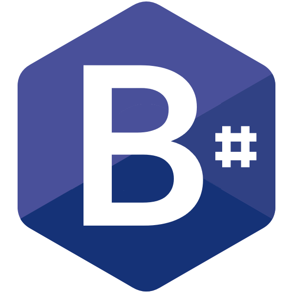

# B# (bsharp.net)

I've had an idea for several years now to create what most people would consider an absolutely absurd project - but it's something that just hasn't exited my brain.  Additionally, over the years, ideas have been either *in my head* or as simple separate experiments to test a few ideas. All of that changes with this project.

## Purpose

The initial goal of the project is to recreate the *classic* BASIC experience but have this experience as a first-class citizen of .NET.  Once done, then move the project "forward" through time adding new features/capabilities without breaking this original *classic* experience.

Additionally, this project will strive to remain true to the original spirit of BASIC; as defined by the original creators of the language:

1. It should be easy to learn for the beginner.
2. It should be a general-purpose language, allowing the writing of any program.
3. Advanced features have to be added so that, if there was a price, it was paid by the expert, not the novice.
4. It should take full advantage of the fact that the user could interact with the computer.
5. It should give error messages that are clear and friendly to the user.
6. It should give fast response for small programs.
7. No understanding of the hardware should be necessary.
8. It should shield the user from the operating system.

Finally, it has struck me as *odd* that given the power/capability of modern VB that such a project is written in a more evolved version of BASIC such as VB; the VB compiler, after all, is also written in VB... 

## Plan

For now the rough list contains:

- Implement essentially a very GW-BASIC and/or QBasic like language on the latest version of .NET.
- This will include the necessary runtime to support the *classic* PC graphic, audio, etc. of GW-BASIC/QBasic.
- Add new language features that have come along in VB that can work within the context of GW-BASIC/QBasic.
- Will have a working interpreter to support the immediacy experience (REPL) that GW-BASIC/QBasic provided.
- Will compile to a .NET executable.
- Will contain a built in code-converter to VB (.NET) to allow for (if desired) "graduating" to a more modern BASIC.
- Considering targeting (code-to-code compiler) Javascript or WebAssembly.
- Will be built as a sort of "compiler-as-a-service" inspired by Roslyn - but will not be a clone; more just borrowing of ideas.
- Will have automated (unit) tests to help ensure stability over time.
- Evaluate (long-term) the idea of compiling to other "interesting" target platforms (Arduino, CoCo, C65, etc.)

## Status

See [Roadmap](Roadmap).